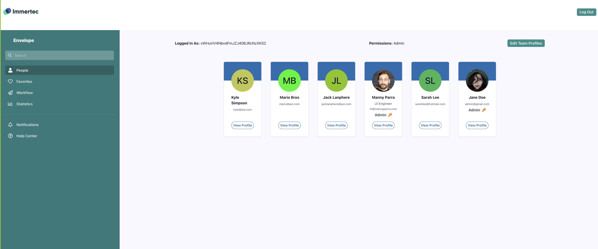
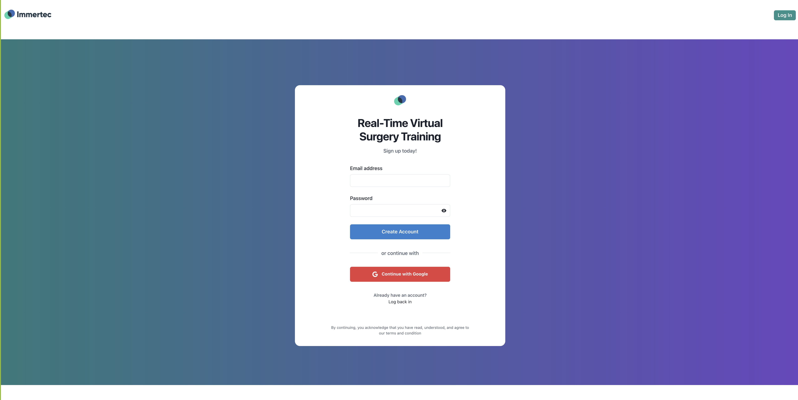

# Immertec Challenge 

## Get Started
### Clone repo, install modules
```bash
git clone git@github.com:manny-p/immertec.git
npm i
```
### Start Server 
- ``npm run dev``

### Create new user @ root
- ``http://localhost:3000/``

### Log in as admin
- ``http://localhost:3000/login``
- admin credentials
```bash
email: admin@gmail.com
password: test123
```
## Screenshots


